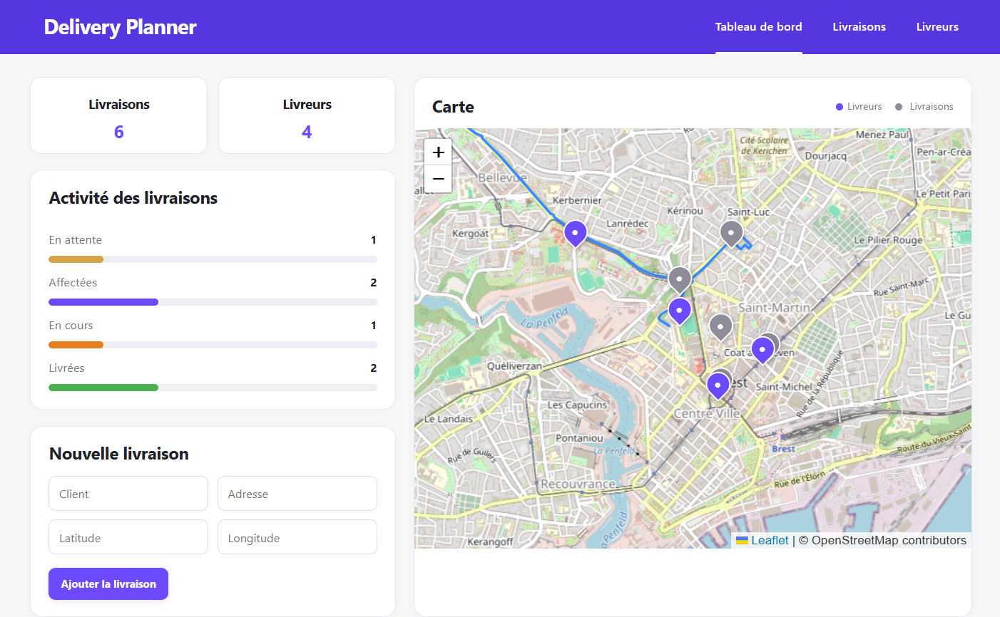
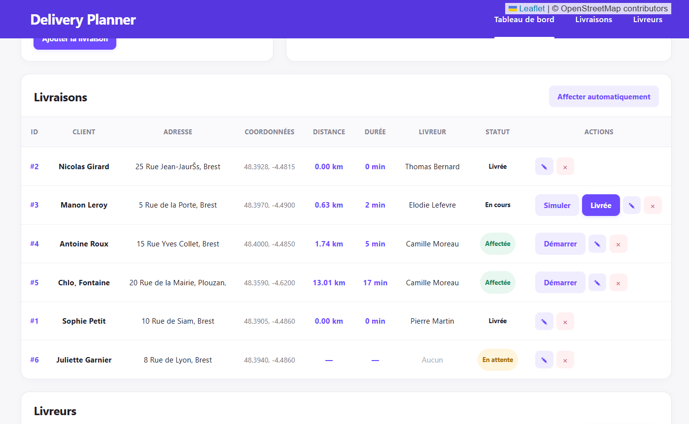
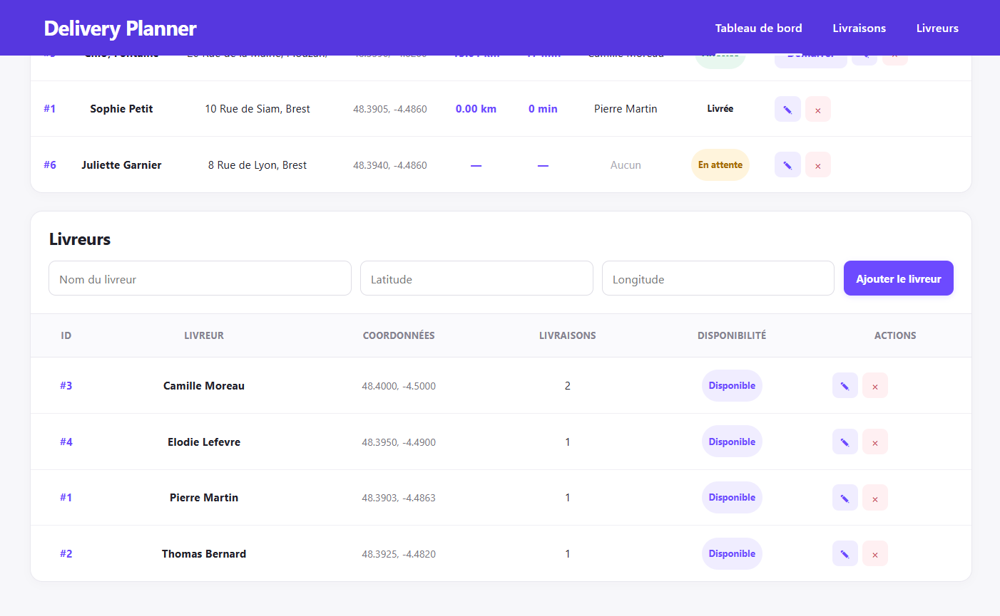

# Delivery Planner

Application web de gestion et de planification de livraisons.

Le projet permet à une entreprise de gérer ses livraisons et ses chauffeurs, d'affecter automatiquement les livraisons aux chauffeurs et de visualiser les trajets sur une carte.

Une simulation GPS permet également de visualiser le déplacement d'un chauffeur le long de son itinéraire.


## Présentation

Delivery Planner est une application développée dans le but de mettre en pratique le développement d'une application avec un backend Java/Spring Boot et un frontend React/TypeScript.

L'application permet notamment de :

- gérer les livraisons 
- gérer les chauffeurs 
- affecter automatiquement les livraisons 
- calculer les distances entre chauffeurs et livraisons 
- calculer des itinéraires routiers 
- visualiser les chauffeurs et les livraisons sur une carte 
- suivre l'état des livraisons 
- simuler le déplacement d'un chauffeur

## Fonctionnalités

### Gestion des livraisons

- Ajouter une livraison
- Modifier une livraison
- Supprimer une livraison
- Consulter les livraisons
- Modifier le statut d'une livraison

Les statuts utilisés sont :

- 'PENDING' : livraison en attente
- 'ASSIGNED' : livraison affectée à un chauffeur
- 'IN_PROGRESS' : livraison en cours
- 'DELIVERED' : livraison terminée

### Gestion des chauffeurs

- Ajouter un chauffeur
- Modifier un chauffeur
- Supprimer un chauffeur
- Modifier la position GPS d'un chauffeur
- Visualiser les chauffeurs sur la carte

### Affectation automatique

L'application peut affecter automatiquement les livraisons aux chauffeurs.

L'algorithme prend en compte :

1. la charge actuelle du chauffeur ;
2. puis la distance entre le chauffeur et la livraison en cas d'égalité.

Les livraisons déjà affectées ne sont pas réaffectées lors de l'affectation automatique de toutes les livraisons.

### Carte et itinéraires

Les chauffeurs et les livraisons sont affichés sur une carte interactive.

Les itinéraires routiers sont calculés avec OSRM.

La distance et la durée estimées du trajet sont affichées dans l'application.

### Simulation GPS

Une livraison affectée peut être démarrée avec le bouton 'Simuler'.

Le chauffeur se déplace alors progressivement le long de l'itinéraire.

Pendant la simulation :

- la position du chauffeur est mise à jour sur la carte 
- sa position est également enregistrée dans PostgreSQL 
- à la fin du trajet, la livraison passe automatiquement à l'état 'DELIVERED'

## Technologies

Backend :
- Java 25
- Spring Boot
- Spring Data JPA / Hibernate
- PostgreSQL
- Maven

Frontend :
- React
- TypeScript
- Vite
- Leaflet / React-Leaflet

Autres
- OSRM pour les itinéraires
- OpenStreetMap
- Git / GitHub

## Architecture
```text
React / TypeScript
        |
        | HTTP / REST
Spring Boot
        |
        |--- Controller
        |
        |--- Service
        |
        |--- Repository
                |
          JPA / Hibernate
                |
           PostgreSQL
```

## Installation et lancement

### Prérequis

- Java 25
- Node.js / npm
- PostgreSQL
- Git

### Backend

Depuis le dossier 'backend/delivery-planner' : .\mvnw.cmd spring-boot:run
Depuis le dossier 'frontend' : 
- npm install
- npm run dev

### Configuration de la base de données

Créer une base PostgreSQL nommée 'delivery_planner'.

Le mot de passe PostgreSQL est fourni avec la variable d'environnement 'DB_PASSWORD'.

## Captures d'écran







## Démonstration

Une vidéo de démonstration de la simulation GPS est disponible dans le projet : 'docs/demonstartion/Delivery_Planner_Demo.mp4'
